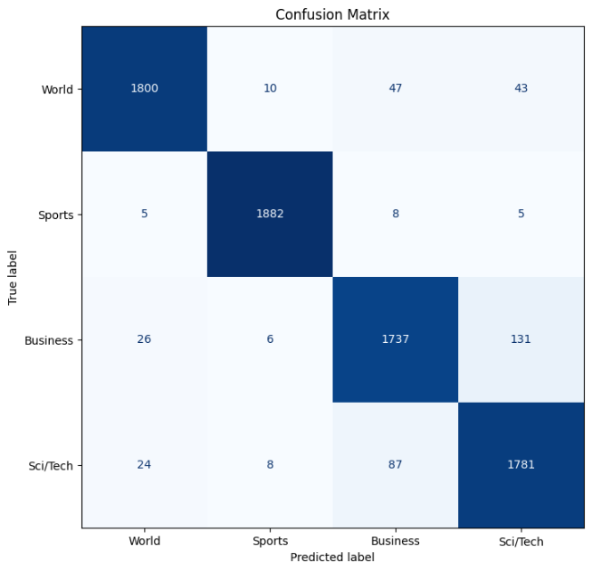
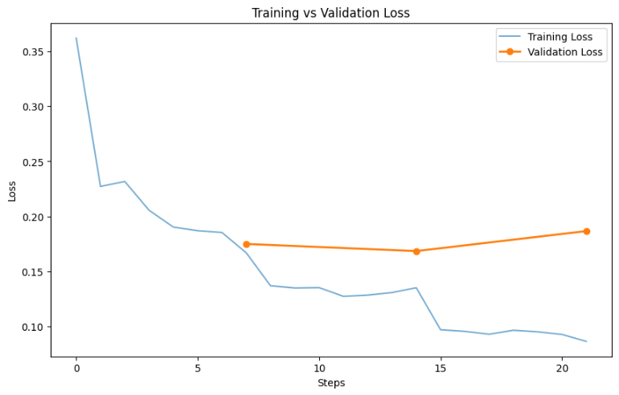

# 📰 DistilBERT AG News Classification

[](https://huggingface.co/spaces/ituvtu/DistilBERT-multi-text)
[](https://hub.docker.com/repository/docker/ituvtu/distilbert-ag-news)
[](https://github.com/ituvtu/DistilBERT-AG-News-Classification)
[](https://github.com/ituvtu/DistilBERT-AG-News-Classification/actions/workflows/tests.yml)
This project implements **Full Fine-Tuning** of the **DistilBERT** model for multi-class news classification. The model categorizes news headlines and short descriptions into 4 classes: **World, Sports, Business, Sci/Tech**.

The solution is deployed as a web application using Gradio and packaged in Docker for easy distribution.

## 📊 Results & Metrics

The model achieved high accuracy on the AG News test dataset (7,600 samples).

| Metric | Value |
| :--- | :--- |
| **Accuracy** | **94.74%** |
| **F1-Score (Weighted)** | **0.9474** |
| **Model Architecture** | DistilBERT Base Uncased (Full Fine-Tuning) |
| **Training Epochs** | 2 (Early Stopping applied) |

### 🔍 Error Analysis
The model performs nearly perfectly on the **Sports** category. The primary challenge lies in distinguishing between the **Business** and **Sci/Tech** classes.



**Insight:** The most common error is misclassifying technology news as business (131 cases). This is likely due to vocabulary overlap: news about tech giants (Apple, Google, Tesla) often contains financial terms (IPO, stocks, quarterly earnings), which semantically aligns them with the Business category.

### 📉 Training Dynamics
We utilized a **Full Fine-Tuning** strategy (unfreezing all layers). Training was stopped after the 2nd epoch as further training led to overfitting (increasing Validation Loss), as shown below.



## 🐳 Quick Start (Docker)

The easiest way to run the project locally is by using the pre-built image from Docker Hub. You do not need to install Python or any dependencies.

```bash
# 1. Pull and run the container
docker run -p 7860:7860 ituvtu/distilbert-ag-news:v1
```

Once running, open your browser at: `http://localhost:7860`

## 🔌 API Usage

This application exposes an API endpoint via Gradio, allowing integration with other software.

### Python Client

You can use the `gradio_client` library to query the model programmatically:

```python
# pip install gradio_client
from gradio_client import Client

client = Client("ituvtu/DistilBERT-multi-text")

result = client.predict(
		text="Apple just announced a new VR headset.",
		api_name="/classify_headline"
)

print(result)
```

## 🛠 Local Development

If you prefer to run the code from source:

1. **Clone the repository:**
   ```bash
   git clone https://github.com/ituvtu/DistilBERT-AG-News-Classification.git
   cd DistilBERT-AG-News-Classification
   ```

2. **Install dependencies:**
   ```bash
   pip install -r requirements.txt
   ```

3. **Run the application:**
   ```bash
   python src/app.py
   ```

## 📂 Project Structure

* `notebooks/AG_News_DistilBERT.ipynb` — Complete training cycle: data preparation, fine-tuning, validation, and visualization.
* `src/app.py` — Inference code and Gradio web interface.
* `Dockerfile` — Instructions for building the Docker image.
* `data/examples.json` — Sample news inputs for quick UI testing.
* `assets/` — Images for documentation (plots, screenshots).

---
*Developed by [ituvtu](https://github.com/ituvtu)*
